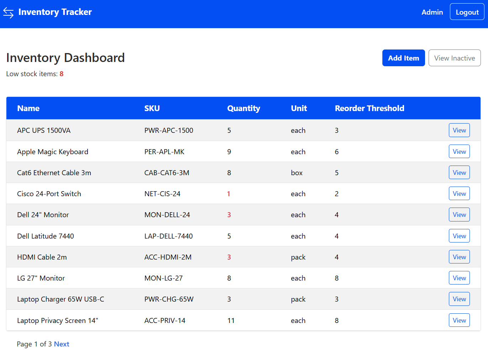

# Inventory Tracker

A full-stack Spring Boot application for internal teams to manage stock levels, audit inventory movements, and surface reorder alerts through a responsive web interface.

**Live Demo:**  [View on Render](https://inventorytracker-jc.onrender.com/)  
*The demo uses seeded sample data to simulate real-world operations.*  
*Initial load may be delayed due to Render cold starts.*  

**Demo Credentials:**

The application requires authentication and role-based access to use the system.  
The following accounts are provided for demonstration purposes.

| Role  | Username | Password |
|------|------|------|
| User | user | user123 |
| Admin | admin | admin123 |

User access allows viewing the dashboard of active items and adding stock movements.  
Admin access allows adding and editing items along with viewing inactive items. 

## Problem
Teams often rely on spreadsheets or informal processes to track inventory, making it difficult to maintain accurate stock counts and understand how inventory changes over time.  

Inventory Tracker centralizes inventory management, movement auditing, and reorder visibility into a single system designed to simplify everyday stock monitoring and operational decision-making.

## Key Features
- Inventory item management with stock tracking
- Movement history auditing to trace how inventory changes over time
- Low-stock alerts surfaced across dashboards, inventory lists, and item views
- Role-based access control with administrative permissions
- Paginated inventory views for efficient browsing of large datasets
- Responsive layouts optimized for both desktop and mobile use

## Architecture & Design Highlights
- Layered Spring Boot architecture separating controllers, services, and repositories
- DTO-based request and view models to isolate domain entities from web input and output
- Inventory quantities derived from movement history using JPQL aggregation queries
- Soft-delete strategy for inventory items to preserve historical movement data
- Business rule enforcement in the service layer using custom domain exceptions
- Server-side pagination for scalable inventory and movement history views
- Role-based access control for administrative routes using Spring Security matchers

## Tech Stack
- **Backend:** Java, Spring Boot  
- **Frontend:** Thymeleaf, Bootstrap  
- **Database:** PostgreSQL  
- **Deployment:** Docker, Render
